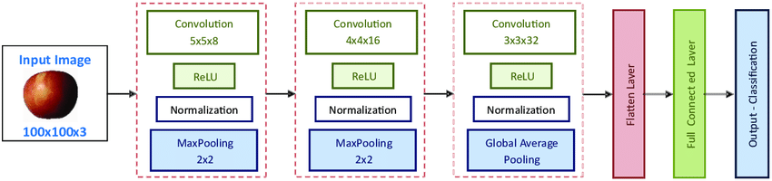
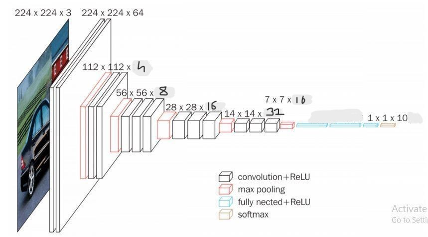
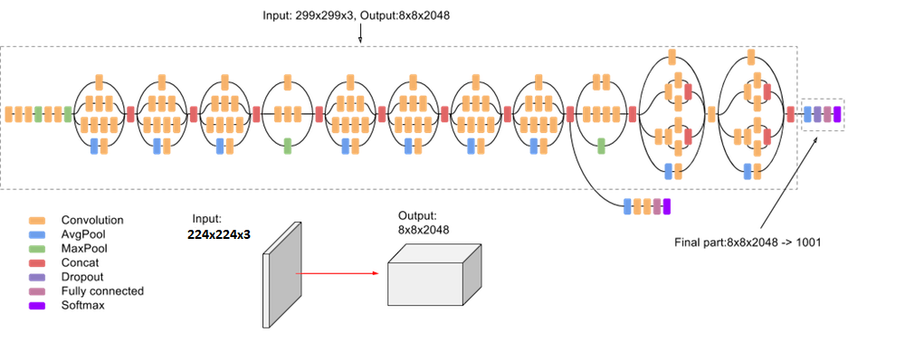
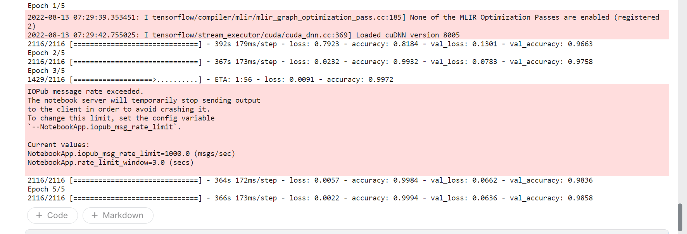
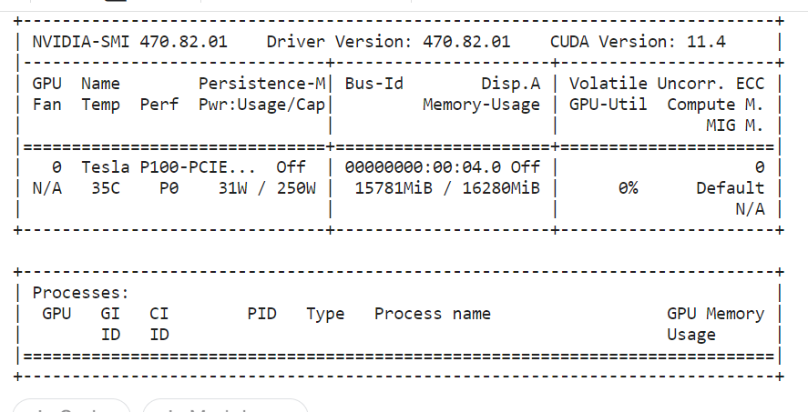

# Fruit classification

### Using simpler methods like using edge features, rgb features, HOG etc with KNN.
The table below summarizes the different approaches used and accuracy obtained: 
|Approach|Accuracy|
|--------|--------|
|RGB features using prototype to test|35%|
|HOG using prototype to test|42%|
|KNN with HOG features|70%|

### Experimenting with complex methods like CNNs.
|Approach|Accuracy|
|--------|--------|
|CNN architecture with 3 Conv2D and 2 MaxPool|88%|
|CNN architecture in the image below|95%

|CNN using altered VGG16 architecture given below|97%

|CNN using transfer learning on Inception V3 architecture given below|98.5%
 
 

### Due to some reason(maybe a bug), the output cells of .ipynb notebooks are not showing up on github, 
so I am adding an image of the training process of the Inception V3 transfer learning model.

### Information of GPU used:

